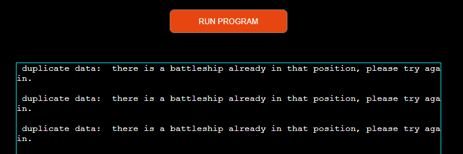

# Fal-Battleship

Fal-Battleship game is a board game played by two peoples or played against a computer. The game board can be of size 5X5, 10X10, 20X20. The user/player must first decide witch game size he/she is interrested in, and then choose whether the battleships positions are decided by the second player or by the computer. Once set up, the user can start the game.  

The live link can be found here - [Fal-Battleship](https://fal-battleships-25fdad662dac.herokuapp.com/)

## How to play
- The player choose the game size:
  - 5X5 comes with five battleships hidden
  - 10X10 comes with ten battleships hidden
  - 20X20 comes with 20 battleships hidden
- Next the player must decide whether to manually (by a friend) place the hidden battleships on the board or let it be done by the computer. In both situation a control is set to avoid bad or wrong data entries.
- The player is then asked is ready to start.
- The player must enter "yes" to start the game. The input box in not case sensitive.
- The player is asked to enter a Colum letter and a row number.
- If the choice coincide with a hidden battleship, the position is marked "X".
- If the choice is wrong, the position is marked with "0".
- The player will have to guess the battleships coordinates until all are found.
- “End of game" message is then printed to signify the player that all the hidden battleships are found.

## Site Owner Goals
- To provide the user with an inactive game that he/she can set up to self chanlenge.
- To present the user with an app that functions well and is easy to use. 
- To entice the user to return to the game by allowing his to pick a more complicated setup if needed.

## User Stories

- ### As a user I want to:
  - Understand what battleships is, a guessing game.
  - by marking the false guesses "0", the user can be sure to have smaller pool of position to choose from at each step. 
  - The user can see how many false guesses he has by looking at the board.
  - Enjoy reaching "end of the game" message.

## Logic Flow

In order to visualise the flow of steps required in the game, The folowwing flow chart is created using "app.diagrams.net". I used it to plan the project and define the functions required at each stage of the execution.

## Features 

### Title and Introduction Section
- When the player starts the game, they are greeted with a motivation message "Fal_Battleship Rocks " then a welcome message. 

- After the greetings The player is then asked set up his game board by choosing the size and how he wants the battleships to be placed on the board 

### Start playing
- When the player is asked if he is ready to play?  The program expects him to type in "yes".  
- when the entry is validated, a starting game board will be shown 

- Upon validation, the player is asked to guess the position of the first battleship: by entering a column letter between A-E or A-I or A-T dependent of the game size. The computer can handle the inputs by using the letter validation function.
- Followed by a request for entering a row number. After validation of the number using number_validation function the position is displayed.  

- The player will be prompted to find the next battlesship until all of them are found. When all battleships are discovered, a winning message a shown. 

### Instructions
- read How to play section.

### Guess entries Validation and Error Handling
- The following input validation is carried out on the userentries:
  - validate_willing_to_play().
        * "yes" entry is mendatory to proceed in the game. it is not case sensitive.  
  - validate_battleships_positions_letter().
        *  The letter entry must be a letter with the game size setting. an error message is displayed if entry is wrong. 
  - validate_battleships_positions_number_0()
        * this validation function was introduced last because of negative value that i have noticed at the final stage of the project.
        * it is to verify if the enterd number is equal or greater than 1. 
  - validate_battleships_positions_number()
        * make sure the number are within the number allowed in the game settings
  - already_used_position()
        * this function is to prevent that the same possition is choosen more than one by the player or during the settings.
        * duplicate date error is issued in those cases.
  

## Testing

### CI python validator

The python file is been ran through CI Python Linter. No errors was reported. THe image below shows the result:

  
run.py

  

### Game testing

The game was tested thoroughly to ensure the following features worked as intended:
- The player choice of settings are exactly what the program displayed.
    * game board size
    * number of battleships
- The player is aware of the number of ships left yet to be found.
- All the player guesses are displayed on the game board.
    * X = hit
    * O = miss
    * _ = position not yet played
- The game ends if the user has found all the ships.

All of the above tests were completed in my local terminal and also in the Heroku terminal.

The README.md was passed through Grammarly and all links were checked before final submission

### Python Libraries:

- [random module](https://docs.python.org/3/library/random.html) - `random.choice` is used to pick random intenger while placing the position of the battleships.
- [os](https://docs.python.org/3/library/os.html?highlight=os#module-os) 
  - `os.system` is used in order to clear the terminal when beginning a new game.  
- [gspread](https://pypi.org/project/gspread/): to allow record the battleships position on Google Sheets. 
- [google.oauth2.service_account](https://google-auth.readthedocs.io/en/stable/index.html):  used to validate credentials and grant access to google service accounts.
- [pandas](https://pypi.org/project/pandas/) - used to process the colums and rows and display them in a two dimentionnal settings.  
- [pyfiglet](https://pypi.org/project/pyfiglet/0.7/) - for taking ASCII text and rendering it into ASCII
- 

### Programs Used

- [GitHub](https://github.com/) - used for version control.
- [Heroku](https://dashboard.heroku.com/apps) -  used to deploy the live project.
- [PEP8 Online](http://pep8online.com/) - used to validate all the Python code
- [Grammerly](https://app.grammarly.com/) - used to proof read the README.md

## Credits 
### Resources Used

- I followed Love Sandwiches when setting up my Google Sheets API.
- [W3Schools](https://www.w3schools.com/)  
- [Stack Overflow](https://stackoverflow.com/) 
- [geeksforgeeks](https://www.geeksforgeeks.org/)

## Acknowledgments

The Code Institute slack community for their quick responses and very helpful feedback!